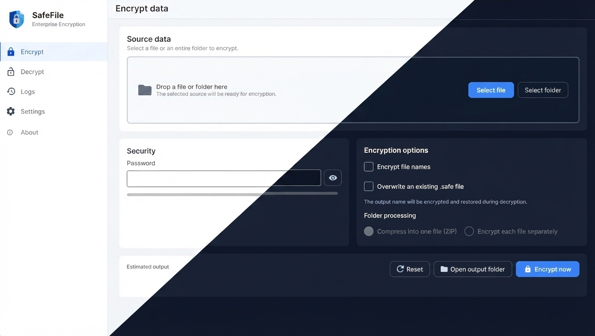
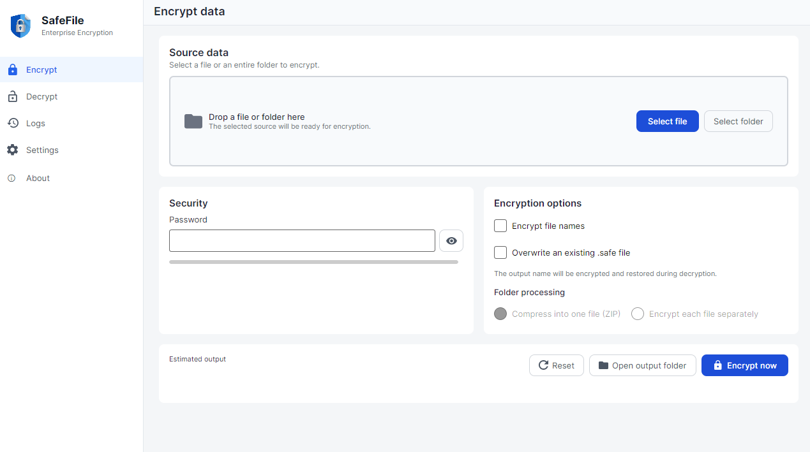
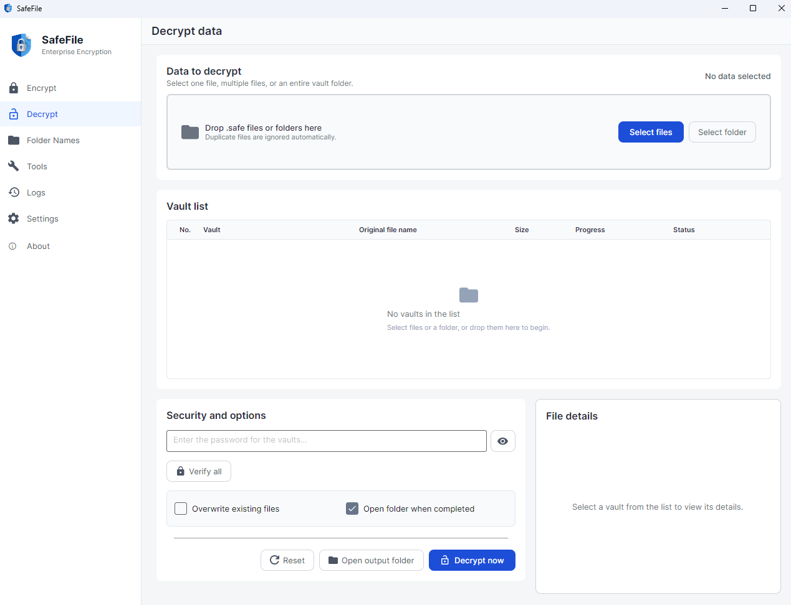
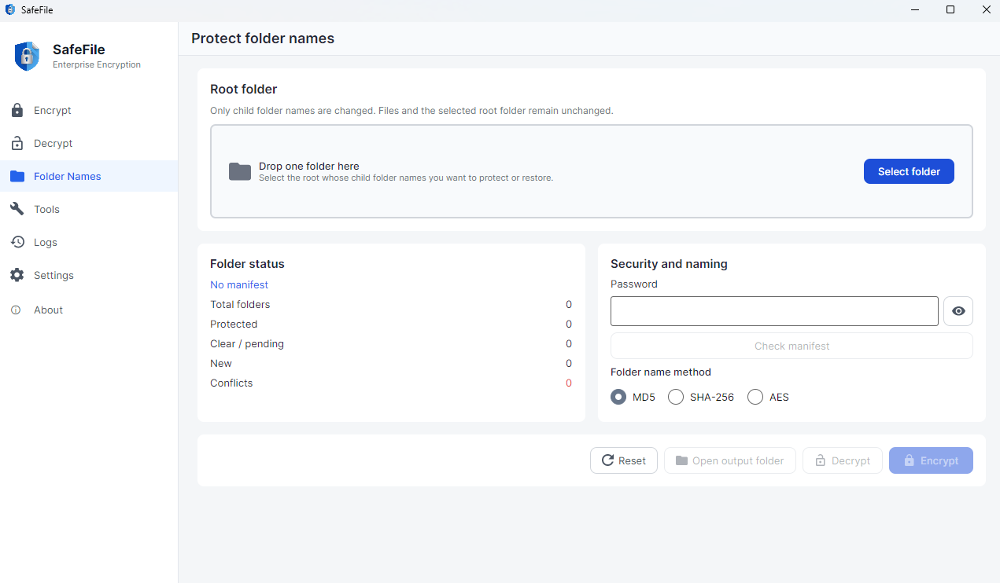
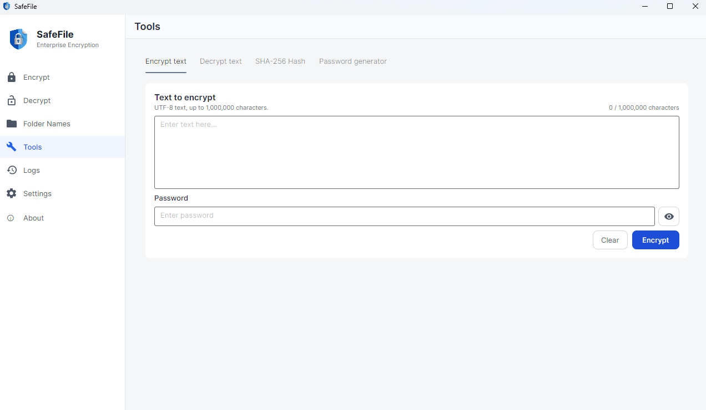
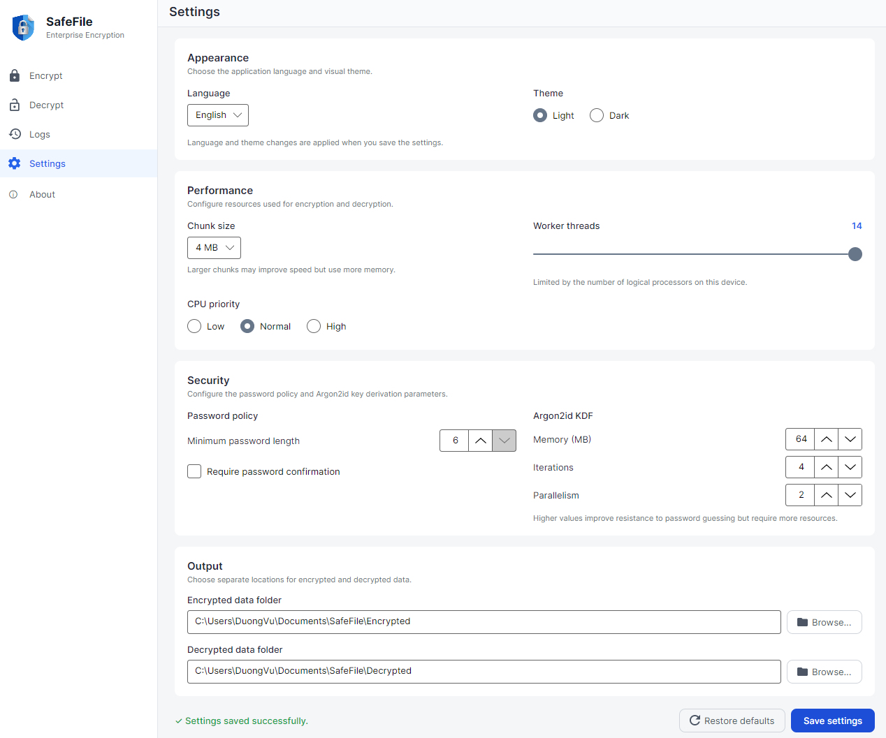

<div align="center">


# SafeFile

### Encrypt files and folders locally — no account and no cloud.

SafeFile encrypts files and folders into authenticated `.safe` vaults with
**AES-256-GCM** and password keys derived through **Argon2id**, then decrypts
them to restore the original content and names. Everything runs locally—your
files and passwords are never sent to a remote service.

[](https://dotnet.microsoft.com/)
[](https://avaloniaui.net/)
[](#security)
[](LICENSE)

</div>



## Highlights

- Run on Windows, Linux, and macOS.
- Encrypt one file, multiple files, or a folder.
- Store a folder as one ZIP vault or one vault per file (`PerFile`).
- Protect visible filenames with MD5, SHA-256, or AES while retaining the
  authenticated full original name inside the vault.
- Protect descendant folder names through an encrypted, resumable manifest.
- Exclude selected folder branches from processing.
- See per-file progress, speed, ETA, and Windows taskbar progress.
- Encrypt through a configurable multi-worker pipeline that processes chunks
  in parallel while preserving their output order for high throughput on
  modern multi-core CPUs.
- Stream data in bounded chunks instead of loading whole files into memory.
- Preserve existing output unless overwrite is explicitly enabled.
- Encrypt/decrypt text, calculate SHA-256, and generate secure passwords.
- Use Multi-language with Light and Dark themes.
- Search, filter, and export structured application logs.

## Using SafeFile

### Encrypt

Select one or more files, or a folder, enter a password, and choose a mode:

| Source | Mode | Result |
|---|---|---|
| One or more files | File | One `.safe` vault per file |
| Folder | ZIP | One vault containing the folder |
| Folder | PerFile | One vault per regular file, preserving structure |



### Decrypt

Add one vault, multiple vaults, or a folder to scan recursively. The queue shows
each vault's name, authenticated original name, size, progress, and result.
Large-folder scanning runs away from the UI thread so the window stays
responsive.



### Protect folder names

The **Folder Names** page renames descendant directories without changing file
names or file contents. Do not delete, edit, rename, or move `.safefile-names`
while names are protected; this manifest is required to restore them.



### Tools

The **Tools** page includes authenticated text encryption/decryption (up to
1,000,000 characters), SHA-256 hashing, and a secure password generator.



### Settings

The **Settings** page controls language and theme, chunk size, worker threads,
CPU priority, password policy, Argon2id parameters, and separate encrypted and
decrypted output folders. The default output structure is:

```text
Documents/SafeFile/
├── Encrypted/
└── Decrypted/
```



## Security

- AES-256-GCM protects confidentiality and detects modification or corruption.
- Argon2id makes offline password guesses consume time and memory.
- Every vault receives a unique random salt and nonce prefix.
- Passwords and keys are never stored in settings or logs; sensitive buffers
  are cleared after use.
- Processing stays on the current device and requires no account.

Use a strong, unique password—preferably at least 16 random characters or six
independently selected Diceware words. Common phrases, names, dates, reused
credentials, and keyboard patterns may be guessed quickly regardless of the
encryption algorithm.

### Why password strength matters

The table below illustrates the relative strength of **truly random**
passwords. It assumes an extremely aggressive aggregate attack rate of one
million Argon2id guesses per second and finding the password halfway through
the search space on average. These figures are intentionally conservative
estimates—not benchmarks or guarantees—and do not apply to human-created or
reused passwords.

| Truly random password | Approximate average time |
|---|---:|
| 8 lowercase letters | about 29 hours |
| 8 letters + digits | about 3.5 years |
| 10 letters + digits | about 13,000 years |
| 12 letters + digits | about 51 million years |
| 16 letters + digits | about 756 trillion years |

### Limitations

- Forgotten passwords cannot be recovered.
- Malware or keyloggers on a compromised device can capture passwords or
  plaintext.
- Secure deletion cannot be guaranteed on SSDs, snapshots, or copy-on-write
  filesystems.
- SafeFile has not yet undergone an independent professional security audit.

For the vault format, nonce construction, validation rules, API contracts, and
pipeline details, read the
**[SafeFile.Core Technical Guide](SafeFile.Core/README.md)**. See also
[RFC 9106](https://www.rfc-editor.org/rfc/rfc9106.html) and the
[OWASP Cryptographic Storage Cheat Sheet](https://cheatsheetseries.owasp.org/cheatsheets/Cryptographic_Storage_Cheat_Sheet.html).

## Disclaimer

SafeFile is provided for lawful purposes only. You are solely responsible for ensuring that your use of the application complies with all applicable laws and regulations. The developers and contributors do not endorse or accept responsibility for any illegal, unauthorized, or harmful use of SafeFile.

The software is provided “as is,” without warranties of any kind. To the fullest extent permitted by law, the developers and contributors are not liable for data loss, corrupted files, failed encryption or decryption, forgotten passwords, hardware or software failures, incompatibilities, or any other direct or indirect damages resulting from the use of this application.

## Build from source

Install the [.NET 10 SDK](https://dotnet.microsoft.com/download/dotnet/10.0).
The project is currently built and validated primarily with the Windows
toolchain.

```powershell
git clone https://github.com/kevinxvu/SafeFile
cd SafeFile
dotnet restore SafeFile.slnx
dotnet build SafeFile.slnx
dotnet run --project SafeFile/SafeFile.csproj
```

From WSL using the Windows .NET SDK:

```bash
dotnet.exe build SafeFile.slnx
```

## Project structure

```text
SafeFile.Core/          Cryptography and file-processing layer
SafeFile/               Avalonia desktop application
SafeFile.Core.Tests/    Regression tests
SafeFile.slnx           Solution
```

## Contributing

Issues, security reviews, translations, tests, documentation, and focused pull
requests are welcome. Keep `SafeFile.Core` independent from Avalonia, never log
sensitive data, preserve output unless overwrite is explicit, keep English and
Vietnamese resources synchronized, and build the full solution before
submitting changes.

For suspected vulnerabilities, prefer the repository's private security
reporting channel over publishing exploit details in a public issue.

## License

SafeFile is available under the [MIT License](LICENSE).
